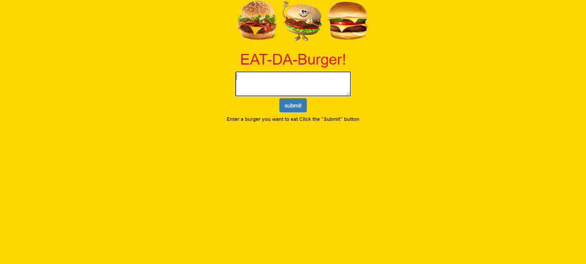
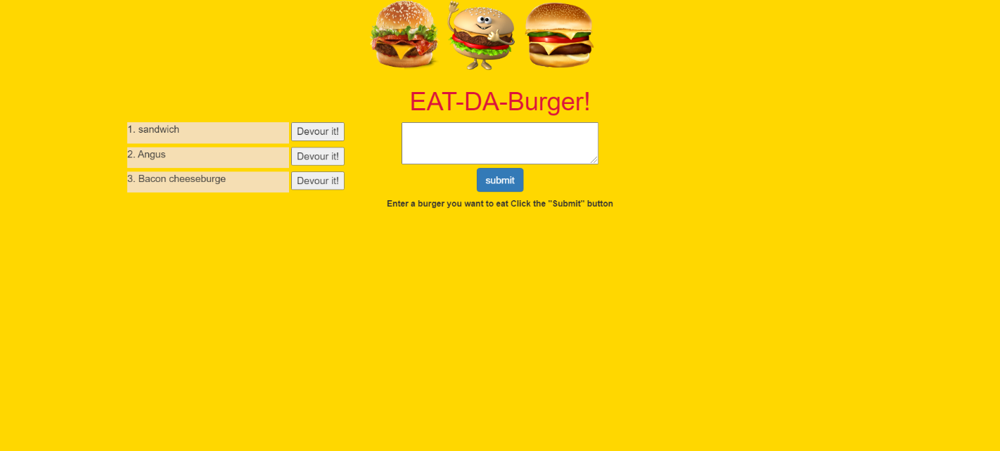

# Burger

## Table of Contents

* [Introduction](#Introduction)
* [Installation](#Installation)
* [License](#License)
* [Screenshot](#Screenshot)
* [Link](#Link)

## Introduction

* Eat-Da-Burger! is a restaurant app that lets users input the names of burgers they'd like to eat.
* Whenever a user submits a burger's name, your app will display the burger on the left side of the page waiting to be devoured.
* Each burger in the waiting area also has a `Devour it!` button. When the user clicks it, the burger will move to the right side of the page.
## Installation

* node js 
* Visual Studio Code 1.51.1
* express
* express handlebars
* MySQL

## License

## Screenshot

## Link

* Link: https://sheltered-castle-40664.herokuapp.com/

